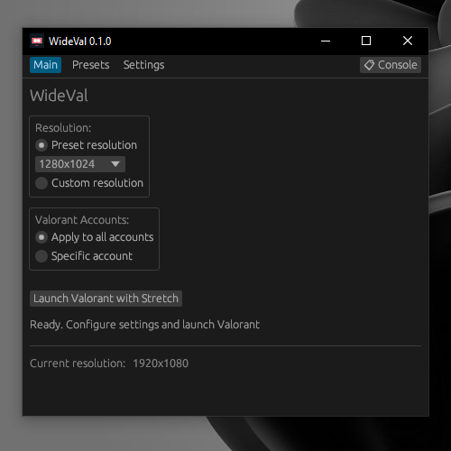
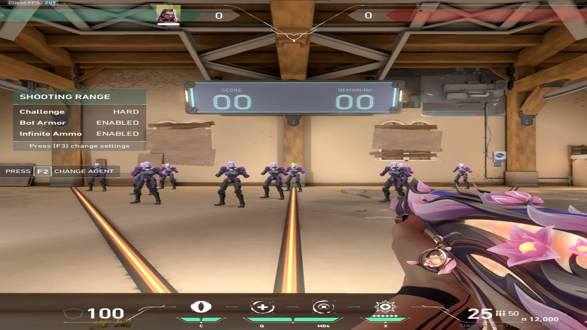

<div align="left">

# WideVal

Utility for proper stretched resolution in Valorant with model stretching



</div>

## What is this?

WideVal enables true stretched resolution in Valorant. Unlike the game's built-in resolution options, WideVal actually stretches player models and the entire game view - similar to CS2.
It changes your display settings and game config files, launches VALORANT, and restores everything when you're done

#### Preview in 1080x1080:

<div align="center">

</div>

## Features

- Custom resolution input
- Multiple Valorant accounts support
- Save presets for quick switching
- Auto-restore settings on exit

## Usage

1. Select resolution
2. Click "Launch Valorant with Stretch"
3. Play
4. Close game - settings restore automatically

## Is this safe?

Yes. WideVal only modifies config files and Windows display settings. It doesn't inject into the game, modify memory, or interact with anti-cheat.

This is the same as manually editing your config and changing resolution in Windows settings - which is allowed by Riot Games.

## Installation

Download `WideVal.exe` and run it. No installation needed.

Or build from source:
```bash
cargo build --release
```

## License

MIT